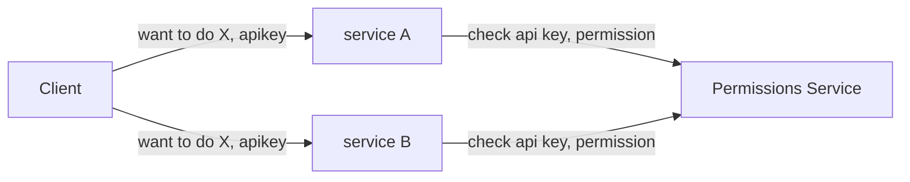
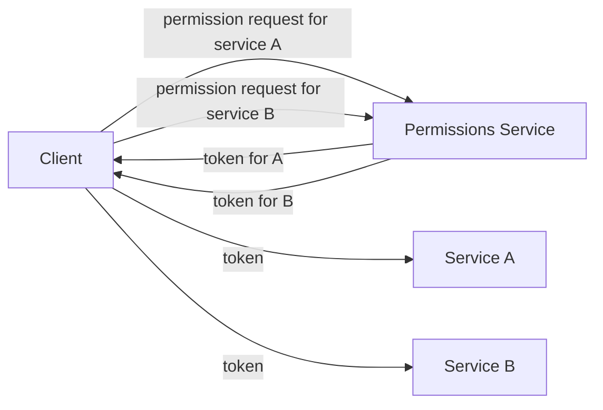
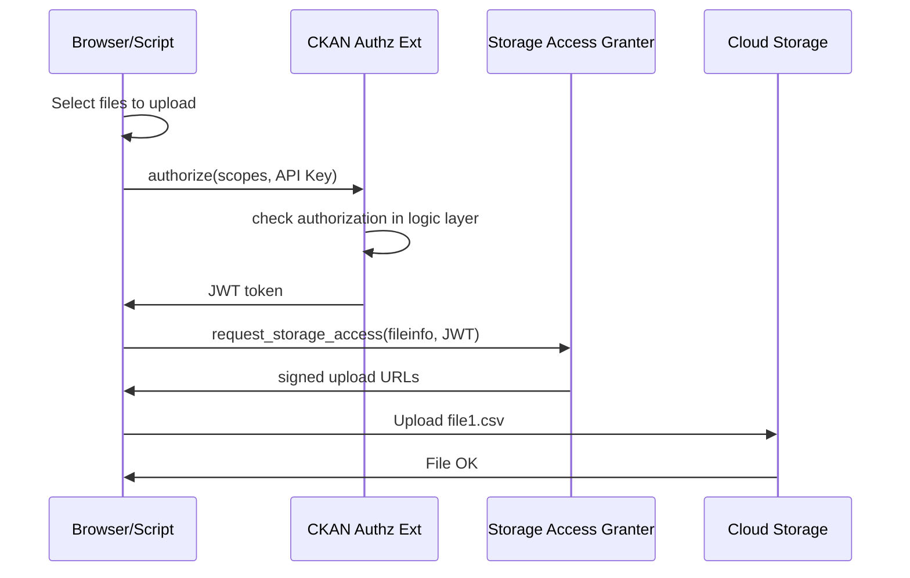
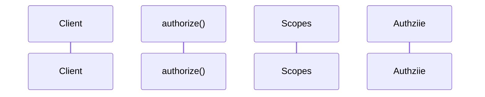

# Authorization APIs (and JWT) for CKAN

- Start Date: 2020-04-09
- Last Modified: 2020-06-24
- Author: Rufus Pollock
- Target Major Version: 2.x
- Reference Issues: (fill in existing related issues, if any)
- Implementation PR: (leave this empty)
- Status: Implemented - https://github.com/datopian/ckanext-authz-service

## Summary

* Having APIs for Authorization would be really useful
  * `/api/3/action/is_authorized?object=dataset/abc&action=update&userid=XXX => True/False`
  * Why? Because it makes it possible to build separate web apps/services that can incorporate authorization information. E.g. a decoupled [(read) frontend][fe] or Admin UI.
* Even better these would be for CKAN to get full JWT support and issue tokens so as to improve security and performance, and so that CKAN can evolve to a microservice architecture
  * `/api/3/action/authorize?scopes=... => token`
  * See below for more on token based approach
  * Why is a microservice architecture good? that's a broader discussion (see below)
* At Datopian we have just built an extension to do this https://github.com/datopian/ckanext-authz-service

[fe]: https://github.com/datopian/frontend-v2

## Working implementation

https://github.com/datopian/ckanext-authz-service

## Overview

* Definitions: auth(entication) and (authz)orization - see http://tech.datopian.com/permissions/
* Authentication has 3 parts

### Introduction to JWT and tokens (or What's the problem with API Keys?)

* API keys are unscoped: they have full power for that given user ... => scoped API Keys / tokens ...
* ...

Service A, Service B, Permissions Service "P"

Every action on every service is going to hit Service P

Also any compromise in any service compromises your API key! Which is universal, full power token!! (b/c i send my api key to every service ...)

A token setup is INVERSION of CONTROL ...

If i compromise your token for A i have only that ... (scoping)

Also one request to service P and then i can do lots of requests on A ... => high performance, no latency ...

Qu: how does service A know the token is valid? Because P **signs it** with its public key ...

## Use Case

### Frontend

When building a decoupled read frontend I want to display edit buttons (or other permissions based UI) to users based on their permissions so that they have a great experience

### Cloud Storage

Storage access with a microservice "Storage Access Granter"

## How it works internally

TODO

## FAQs

### How does this relate to Sergey's work in https://github.com/ckan/ckan/pull/5146/

Sergey's work is somewhat related and somewhat orthogonal. It is primarily about issuing API tokens in place of API keys and making them time limited rather than doing delegated authorization.

* Making API keys time limited

Bonus

* Being able to invalidate or rate limit these tokens
